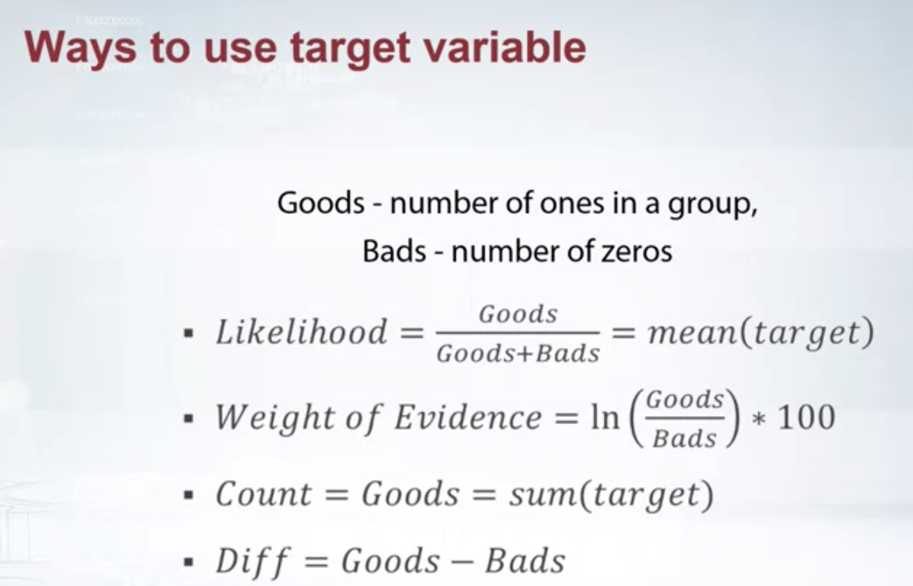

## How to Win a Data Science Competition: Learn from Top Kagglers

### Competition mechanics

Real world ML pipeline:
* Understanding of business problem
* Problem formalization
* Data collecting
* Data preprocessing
* Modeling
* Way to evaluate model in real life
* Way to deploy model

About Competition:
* It's not only about algorithms
* It is all about data and making things work, not about algorithms itself
  - Everyone can and will tune classic approaches
  - We need some insights to win
* Sometimes there is no ML
* It is ok to use Heuristics and manual data analysis
* Do not be afraid of complex solutions, advanced feature engineering, and doing huge calculation

No Free Lunch Theorem:
* There is no method which outperforms all others for all tasks.
* For every method we can construct a task for which this particular method will not be the best.


### Feature extraction from text and images

Preprocessing:
* scaling
* outliers
* ranking
* transformation

Feature generation:
* prior knowledge
* EDA

Numeric feature preprocessing is different for tree and non-tree models:
* Tree-based models doesn't depend on scaling
* Non-tree-based models hugely depend on scaling

Most often used preprocessings are:
* MinMaxScaler - to [0, 1]
* StandardScaler - to (mean=0, std=1)
* Rank - set spaces between sorted values to be equal
* np.log(1+x) and np.sqrt(1+x)

Categorical and ordinal features:
* Label encoding: sklearn.preprocessing.LabelEncoder or Pandas.factorize
* Frequency encoding: [S, C, Q] -> [0.5, 0.3, 0.2]
* Values in ordinal features are sorted in some meaningful order
* Label encoding maps categories to number
* Frequency encoding maps categories to their frequencies
* Label and Frequency encodings are often used for tree based models
* One-hot encoding is often used for non-tree-based models
* Interactions of categorical features can help linear models and KNN

Date and time:
* Periodicity: day number in week, month, season, year etc.
* Time since:
  - Row-independent moment: e.g. since 1. Jan, 2000
  - Row-dependent important moment: Number of days left until next holiday.
* Difference between dates

Coordinates:
* Interesting places from train/test data or additional data
* Centers of clusters
* Aggregated statistics

Missing values:
* The choice of method to fill NaN depends on the situation
* Usual way to deal with missing values is to replace them with -999, mean or median
* Missing values already can be replaced with something by organizers
* Binary feature "isnull" can be beneficial
* In general, avoid filling nans before feature generation
* Xgboost can handle NaN

Text to vectors:
* Bag of words
  - very large vectors
  - meaning of each value in vector is known
* Embeddings (word2vec)
  -  relatively small vectors
  - values in vector can be interpreted only in some cases
  - the words with similar meaning often have similar embeddings

Pipeline of applying Bag of words:
* Preprocessing: lowercase, stemming, lemmatization, stopwords
* Ngrams can help to use local context
* Postprocessing: TFiDF

### Exploratory Data Analysis

* Better understand the data
* Build a intuition about the data
* Generate hypothesis
* Find insights
* Use visualization

Explore individual features:
* Historgram
* Plot (index vs value)
* statistics

Explore feature relations:
* Pairs: scatter plot, scatter matrix, corrplot
* Groups: Corrplot + clustering, plot (index vs feature statistics)

### Validation

Validation helps us answer the question, what will be the quality of our model on the unseeing data and help us select the model which will be expected to get the best quality on that test data.

Usually, we are trying to avoid underfitting on the one side that is we want our model to be expressive enough to capture the patterns in the data. And we are trying to avoid overfitting on the other side, and don't make too complex model, because in that case, we will start to capture noise or patterns that doesn't generalize to the test data.

Validation strategy:
* Holdout: If we have enough data, and we're likely to get similar scores and optimal model's parameters for different splits, we can go with Holdout.
* KFold: If on the contrary, scores and optimal parameters differ for different splits, we can choose KFold approach.
* Leave-one-out: If we have too little data, we can apply leave-one-out. T
* Stratification: It helps make validation more stable, and especially useful for small and unbalanced datasets.

Different splitting strategies can differ significantly
* in generated features
* in a way the model will rely on that features
* in some kind of target leak

Splitting data into train and validation
* Random, rowwise
* Timewise
* By id

* Logic of feature generation depends on the data splitting strategy.
* Set up your validation to mimic the train/test split of the competition.

Causes of different scores and optimal parameters:
* Too little data
* Too diverse and inconsistent data

If we have big dispersion of scores on validation stage, we should do extensive validation.
  - Average score from different KFold splits
  - Tune model on one split and evaluate score on the other
If submission's core do not match local validation score, we should
 - Check if we have too little data in public LB
 - Check if we overfitted
 - Check if we chose correct splitting strategy
 - Check if train/test have different distributions

### Metrics optimization

[Regression metrics](https://towardsdatascience.com/how-to-select-the-right-evaluation-metric-for-machine-learning-models-part-1-regrression-metrics-3606e25beae0):
* MSE, RMSE, R-squared (they are the same from optimization perspective, biased towards the huge value)
  - Useful if we have unexpected values that we should care about. Vey high or low value that we should pay attention. Sensitive to outliers.
  - MSE is quite biased towards the huge value from our dataset while MAE is much less biased.
* MAE (less sensitive to outliers)
* (R)MSPE, MAPE (biased towards small values)
  - MSPE can be thought as weighted versions of MSE. The weight of its sample is inversely proportional to it’s target square.
  - MAPE is considered as the weighted version of MAE the optimal constant predictions for MAPE it turns out to be the weighted median of the target values.
  - MSPE and MAPE are biased towards smaller targets because they assign higher weight to the object with small targets.
* (R)MSLE: it is just an RMSE calculated in logarithmic scale.
  - RMSLE penalizes an under-predicted estimate greater than an over-predicted estimate.
  - RMSLE is frequently considered as better metrics than MAPE, since it is less biased towards small targets, yet works with relative errors.


How to optimize MSPE (MAPE):
* Use weights from samples (`sample_weights`)
  - And use MSE(MAE)
  - Not every library accepts sample weights
    - XGBOOST, LightGMB accept
* Resample the train set
  - df.sample(weights=sample_weights)
  - And use any model that optimizes MSE(MAE)
  - Usually need to resample many times and average

For RMSLE,
* Train: transform target z=log(y+1) and fit a model with MSE loss
* Test: transform predictions back: y=exp(z) - 1

[Classification metrics](https://towardsdatascience.com/how-to-select-the-right-evaluation-metric-for-machine-learning-models-part-3-classification-3eac420ec991):
* Accuracy, LogLoss, AUC
  - Accuracy is a good measure when the target variable classes in the data are nearly balanced.
  - So basically if we want to focus more on minimizing False Negatives, we would want our Recall to be as close to 100% as possible without precision being too bad and if we want to focus on minimizing False positives, then our focus should be to make Precision as close to 100% as possible.
* Cohen's (Quadratic weighted) Kappa


### Mean encoding/target encoding

The general idea of this technique is to add new variables based on some feature to get where we started.

* Label encoding gives random order. No correlation with target.
* Mean encoding helps to separate zeros from ones.


Regularization:
* CV loop inside training data
* Smoothing
* Adding random noise
* Sorting and calculating expanding mean.

### Hyperparameter tuning

* Select the most influential parameters
* Understand how exactly they influence the training
* Tune them (manually or automatically e.g. hyperopt)
* libraries: Hyperopt, scikit-optimize, GPyOpt et al.

Tree-based models:
* GBDT: XGBoost, LightGBM, CatBoost
* RandomForest, ExtraTrees: scikit-learn

### Tips and tricks

Data loading:
* Do basic preprocessing and convert csv/txt files into hdf5/npy for much faster loading.
* Do not forget that by default data is store in 64-bit arrays, most of the times you can safely downcast it to 32-bits.
* Large datasets can be processed in chunks.
Performance evaluation:
* Extensive validation is not always needed.
* Start with fastest models - LightGBM.
Initial pipeline:
* Start with simple solution
* Debug full pipeline
* From simple to complex models
Best practices from software development:
* Use good variable names
* Keep your research reproducible
* Reuse code

### Ensembling
Examined ensemble methods:
* Averaging
* Weighted averaging
* Conditional averaging
* Bagging: average slightly different version of the same model to improve accuracy.
* Boosting: a form of weighted averaging of models where each model is built sequentially via taking into account the past model performance
  - Weight based
    - learning rate: prediction_N = prediction_0*learning_rate + ...+ prediction_N-1*learning_rate
    - number of estimators, input model
  - Residual based (most successful algorithms): add residuals as another feature, and then add new prediction to old prediction.
    - XGboost, lightGBM, CatBoost, sklearn's GBM.
Stacking:
* Split the train set into two disjoint sets
* Train several base learners on the 1st part
* Make predictions with the base learners on the 2nd part
* Use the predictions from above as input to train a higher level model
* Diversity may come from different algorithms or input features
* Performance plateaues after N models
* Meta model is normally modest

StackNet: a scalable meta modeling method that utilizes stacking to combine multiple models in a neural network architecture of multiple levels.

* In a neural network, every node is a simple linear model with some nonlinear transformation.
* Instead of a linear model, we could use any model.


### Ensembling tips and tricks

1st level tips:
* Diversity based on algorithms
  - 2-3 gradient boosted trees (lightgbm, xgboost catboost)
  - 2-3 neural nets (keras, pytorch)
  - 1-2 extratrees/randomforest(sklearn)
  - 1-2 linear models as in logistic/ride or lasso (sklearn)
  - 1-2 knn models (sklearn)
  - 1 factorization machine (libfm)
  - 1 svm with nonlinear kernel if size/memory allows (sklearn)
* Diversity based on input data:
  - categorical features: one hot, label encoding, target encoding
  - numerical features: outliers, binning, derivatives, percentiles
  - interactions: col1*/+-col2, groupby, unsupervised

Subsequent level tips:
* Simpler (or shallower) algorithms:
    - gradient boosted trees with small depth (e.g. 2 or 3)
    - linear models with high regularization
    - extra trees
    - shallow networks (e.g. 1 hidden layer)
    - knn with BrayCutis Distance
    - Brute forcing a search for best linear weights based on cv
* Feature engineering:
   - pairwise differences between meta features
   - row-wise statistics like averages or stds
   - standard feature selection techniques
* For every 7.5 modles in previous level we add 1 in meta
* Be mindful of target leakage
* Software: StackNet 

```Python
# Example of Bagging in SKLEARN
model = RandomForestRegressor()
bags = 10
seed = 1
# create array object to hold bagged predictions
bagged_prediction = np.zeros(test.shape[0])
# loop for as many time as we want bags
for n in range(0, bags):
  model.set_params(random_state=seed+n)
  model.fit(train, y)
  preds = model.predict(test)
  bagged_prediction += preds
# take average of predictions
bagged_prediction = bagged_prediction/bags
```
