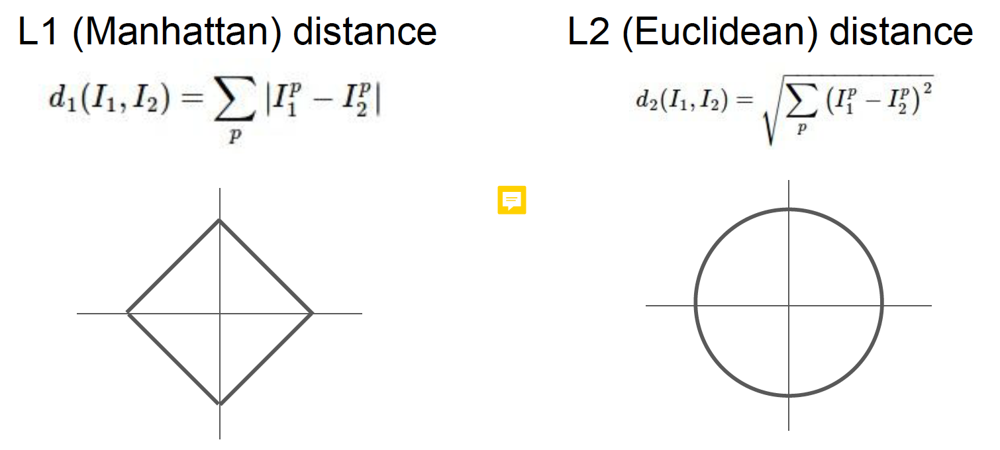
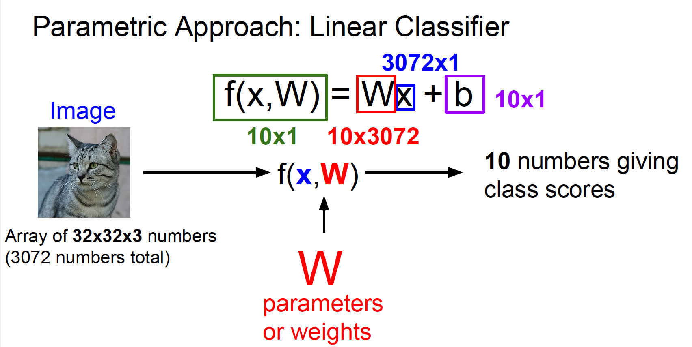
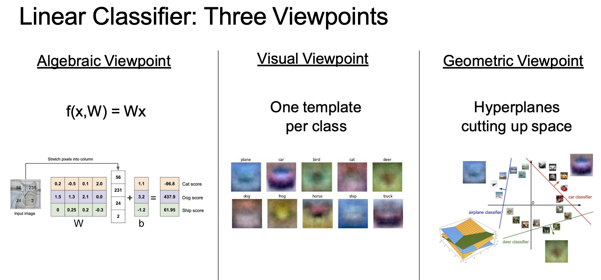

## Image classification: a core task in Computer Vision
* The problem: semantic gap
* Challenges: viewpoint variation, background clutter, illumination, deformation, occlusion, intraclass variation.

## Machine learning: data-driven approach
* Collect a dataset of images and labels
* Use Machine Learning to train a classifier
* Evaluate the classifier on new images

## Nearest Neighbors

Fist Classifier: Nearest neighbor
* Memorize all data and labels
* Predict the label of the most similar training image

K-Nearest Neighbors: Instead of copying label from nearest neighbor, take majority vote from K closest points
* Never used in image classification in real life
* Very slow at test time
* Distance metrics on pixels are not informative
* Curse of dimensionality

Distance metrics:
* L1 distance: sensitive to coordinate system choice
* L2 distance: not sensitive to coordinate system choice

Hyperparameters: choices about the algorithm that we set rather than learn

* Split data into train, val, and test; choose hyperparameters on val and evaluate on test
* Cross-Validation: Split data into folds, try each fold as validation and average the results

K-Nearest Neighbors: Summary
* In Image classification we start with a training set of images and labels, and  must predict labels on the test set
* The K-Nearest Neighbors classifier predicts labels based on nearest training  examples
* Distance metric and K are hyperparameters
* Choose hyperparameters using the validation set;  only run on the test set once at the very end!

## Linear Classification

