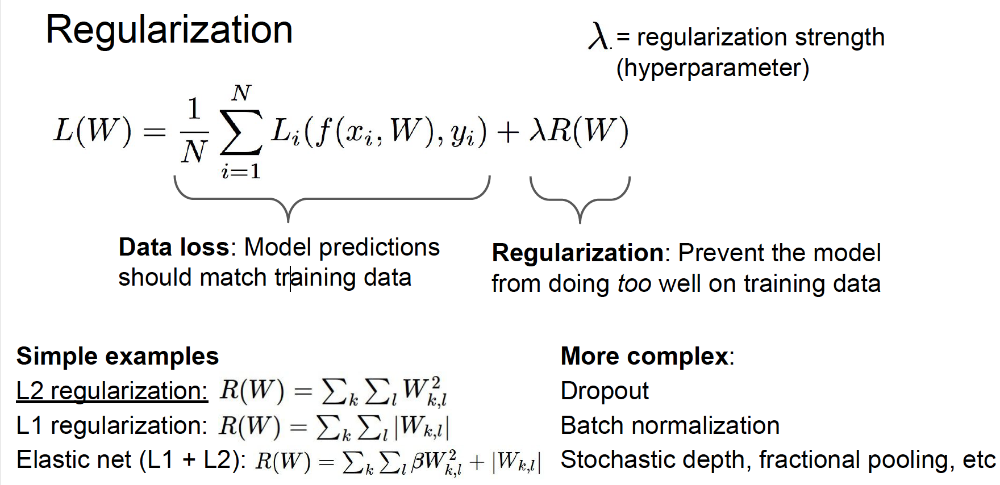

## Loss Function
* A loss function tells how good our current classifier is.
* Loss over the dataset is a average of loss over examples

## Regularization

Why regularize?
- Express preferences over weights
- Make the model simple so it works on test data
- Improve optimization by adding curvature

* SVM: hinge loss
* Softmax: cross-entropy loss

## Optimization
Gradient descent:
* Numerical gradient: approximate, slow, easy to write
* Analytic gradient: exact, fast, error-prone
* In practice: Always use analytic gradient, but check implementation with numerical gradient. This is called a gradient check.

Stochastic Gradient Descent (SGD):
* Full sum is expensive when N is large
* Approximate sum using a minibatch of examples
