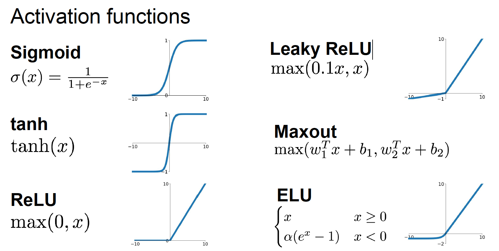
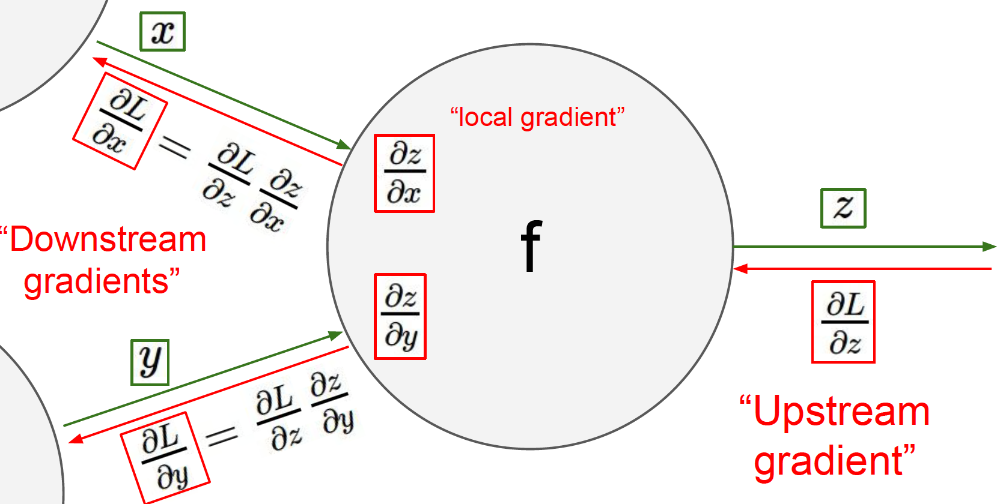
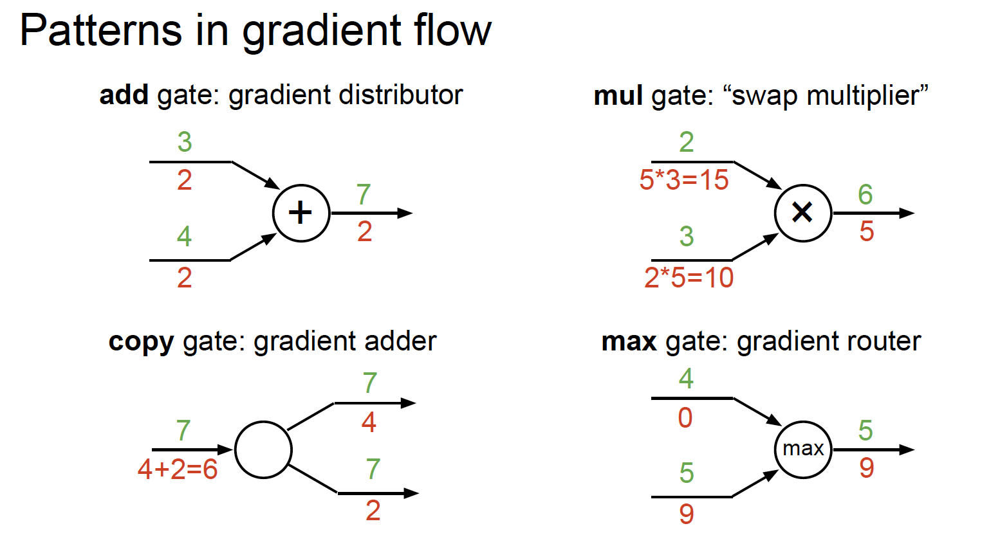

## A simple Neural Network
* (Before) linear score function: f=Wx
* (Now) 2-layer Neural Network: f=W2max(0, W1x)

The function max(0, z) is called activation function. Common activation functions
are as follow:


We typically call a neural network with one hidden layer "2-layer Neural Net" or "1-hiddent-layer Neural Net".

* More neurons more complexity
* Do not use size of neural network as a regularize. Use stronger regularization instead.

## Backpropagation

After we get the loss function, we need to use gradient descent method to optimization the loss function in order to find the best parameters or weights for the neural nets. To do that, we need to calculate the gradient.
* Use chain rule to calculate gradients backward


Computational graph representation may not be unique. Choose one where local gradients at each node can be easily expressed!


## Modularized implementation
```python
class Multiply(torch.autograd.Function):
  @staticmethod
  def forward(ctx, x, y):
    # Need to stash some values for use in backward propagration
    ctx.save_for_backword(x, y)
    z = x * y
    return z
  @staticmethod
  def backward(ctx, grad_z):
    x, y = ctx.saved_tensors
    grad_x = y * grad_z
    grad_y = x * grad_z
    return grad_x, grad_y
```
* (Fully-connected) Neural Networks are stacks of linear functions and
nonlinear activation functions; they have much more representational
power than linear classifiers
* backpropagation = recursive application of the chain rule along a
computational graph to compute the gradients of all
inputs/parameters/intermediates
* implementations maintain a graph structure, where the nodes implement
the forward() / backward() API
* forward: compute result of an operation and save any intermediates
needed for gradient computation in memory
* backward: apply the chain rule to compute the gradient of the loss
function with respect to the inputs

## Assignment1
Two ways of model diagnosis:
* One strategy for getting insight into what's wrong is to plot the loss function and the accuracies on the training and validation sets during optimization.

* Another strategy is to visualize the weights that were learned in the first layer of the network. In most neural networks trained on visual data, the first layer weights typically show some visible structure when visualized.

If the loss is decreasing more or less linearly, which seems to suggest that the learning rate may be too low. Moreover, there is no gap between the training and validation accuracy, suggesting that the model we used has low capacity, and that we should increase its size. On the other hand, with a very large model we would expect to see more overfitting, which would manifest itself as a very large gap between the training and validation accuracy. Tuning the hyperparameters and developing intuition for how they affect the final performance is a large part of using Neural Networks.
