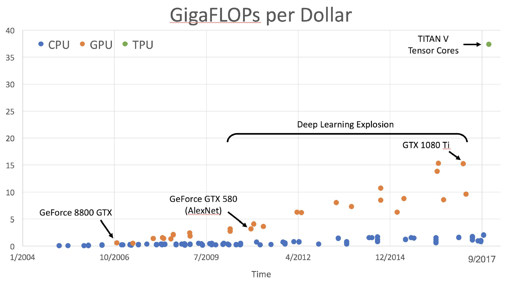

## Deep learning hardware

If you aren’t careful, training can bottleneck on reading data and transferring to GPU!
Solutions:
- Read all data into RAM
- Use SSD instead of HDD
- Use multiple CPU threads to prefetch data
## Deep learning software

The point of deep learning frameworks:
* quick to develop and test ideas
* automatically compute gradients
* run it all efficiently on GPU
## PyTorch
* Tensor: like a numpy array, but can run on GPU
* Autograd: package for building computational graphs out of Tensors, and automatically computing gradients
* Module: a neural network layer; may store state or learnable weights
* Dynamics Computation Graph: building the graph and computing the graph happening at the same time
## Static vs Dynamic graphs
* With static graphs, frameworks can optimize the graph for you before it runs. Once graph is built, serialize it and run it without the code that built the graph!
* With dynamic graphs, graph building and execution are intertwined, so always need to keep code around

[ONNX](https://github.com/onnx/onnx) is an open-source standard for neural network models
* Goal: Make it easy to train a network in one framework, then run it in another framework
* Supported by PyTorch, Caffe2, Microsoft CNTK, Apache MXNet

- You can export a PyTorch model to ONNX
- Run the graph on a dummy input, and save the graph to a file
- Will only work if your model doesn’t actually make use of dynamic graph - must build same graph on every
forward pass, no loops / conditionals
