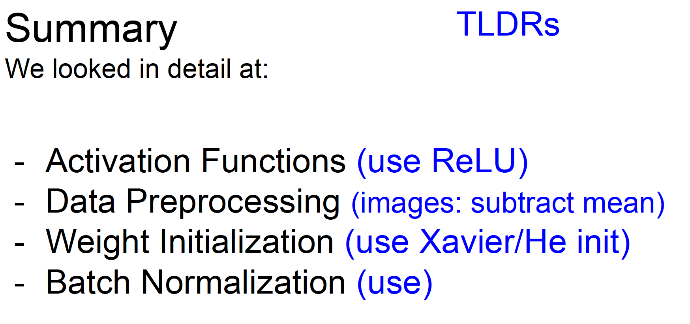

## Overview
1. One time setup
activation functions, preprocessing, weight
initialization, regularization, gradient checking
2. Training dynamics
babysitting the learning process,
parameter updates, hyperparameter optimization
3. Evaluation
model ensembles, test-time augmentation
## Activation functions

Three problems of sigmoid function
* saturated neurons "kill" the gradient
* sigmoid outputs are not zero-centered
* exp() is a bit compute expensive
tanh(x) function
* squashes number to range [-1, 1]
* zero centered
* still kills gradients when saturated
ReLU (Rectified Linear Unit)
* computes f(x) = max(0, x)
* doesn't saturate in positive region
* very computationally efficient
* converges much faster than sigmoid/tanh in practice
* not zero-centered output
Leaky ReLU f(x) = max(0.01x, x)
* doesn't saturate
* computationally efficient
* converges much faster than sigmoid/tanh in practice
* will not "die"
ELU (Exponential Linear Units)
* All benefits of ReLU
* Closer to zero mean outputs
* negative saturation regime compared with Leaky ReLU adds some robustness to noise
* computation requires exp()
Maxout "Neuron"
* Does not have the basic form of dot product -> nonlinearity
* Generalizes ReLU and Leaky ReLU
* Linear Regime! Does not saturate! Does not die!
* Problem: doubles the number of parameters/neuron
In practice:
- Use ReLU. Be careful with your learning rates
- Try out Leaky ReLU / Maxout / ELU
- Try out tanh but don’t expect much
- Don’t use sigmoid

## Data preprocessing
* zero-centered
* normalize
* PCA
* whitening

Before normalization: classification loss very sensitive to changes in weight matrix; hard to optimize
After normalization: less sensitive to small changes in weights; easier to optimize

In practice for images - center only
* substract the mean image
* substract per-channel mean
* substract per-channel mean and divide by per-channel STD
* not common to do PCA and whitening

## Weight initialization
* Initialization too small: Activations go to zero, gradients also zero, No learning
* Initialization too big: Activations saturate (for tanh), Gradients zero, no learning
* Initialization just right:  Nice distribution of activations at all layers, Learning proceeds nicely

## Batch normalization

- Usually inserted after fully connected or convolutional layers and before nonlinearity layers.
- Makes deep networks much easier to train!
- Improves gradient flow
- Allows higher learning rates, faster convergence
- Networks become more robust to initialization
- Acts as regularization during training
- Zero overhead at test-time: can be fused with conv!
- Behaves differently during training and testing: this is a very common source of bugs!

Layer Normalization for fully-connected networks:
* Same behavior at train and test!
* Can be used in recurrent networks

Instance Normalization for convolutional networks
* Same behavior at train / test!

