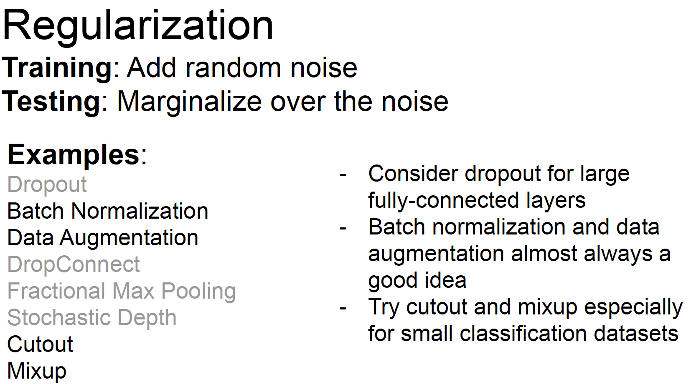

## Optimization

For AdaGrad, step size will decay to zero over long time.

## Early Stopping

## Model ensembles
1. Train multiple independent models
2. At test time average their results
(Take average of predicted probability distributions, then choose argmax)
Enjoy 2% extra performance

Tips and tricks:
* Instead of training independent models, use multiple snapshots of a single model during training!
* Instead of using actual parameter vector, keep a moving average of the parameter vector and use that at test time (Polyak averaging)

## Regularization
* L2
* L1
* Elastic Net
* Dropout: In each forward pass, randomly set some neurons to zero. Probability of dropping is a hyperparameter; 0.5 is common

Dropout is training a large ensemble of models (that share parameters).

A common pattern of regularization:
* Training: add some kind of randomness
* Testing: average out randomness (sometimes approximate)

Data augmentation:
* Horizontal flips
* Random crops and scales
* Color Jitter

## Choosing hyperparameters
Step1: check initial loss
Turn off weight decay, sanity check loss at initialization e.g. log(C) for softmax with C classes

Step2: Overfit a small sample
Try to train to 100% training accuracy on a small sample of
training data (~5-10 minibatches); fiddle with architecture,
learning rate, weight initialization
Loss not going down? LR too low, bad initialization
Loss explodes to Inf or NaN? LR too high, bad initialization

Step3: Find LR that makes loss go down
Use the architecture from the previous step, use all training
data, turn on small weight decay, find a learning rate that
makes the loss drop significantly within ~100 iterations
Good learning rates to try: 1e-1, 1e-2, 1e-3, 1e-4

Step4: Coarse grid, train for ~1-5 epochs
Choose a few values of learning rate and weight decay around
what worked from Step 3, train a few models for ~1-5 epochs.
Good weight decay to try: 1e-4, 1e-5, 0

Step5: Refine grid, train longer
Pick best models from Step 4, train them for longer (~10-20
epochs) without learning rate decay

Step6: Look at loss curves
Losses may be noisy, use a scatter plot and also plot moving average to see trends better
* Loss plateaus: Try learning rate decay
* Learning rate step decay: Loss was still going down when learning rate dropped, you decayed too early!
* Accuracy still going up, you need to train longer
* Huge train / val gap means overfitting! Increase regularization, get more data.
* No gap between train / val means underfitting: train longer, use a
bigger model

Step7: GOTO Step5.

Random Search vs. Grid Search.
