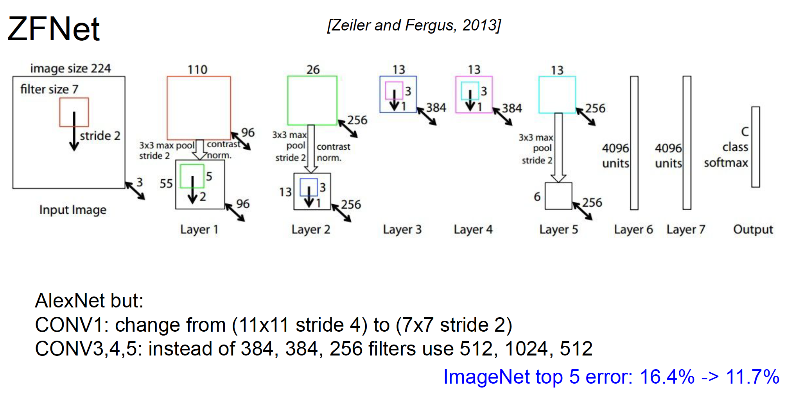

## Transfer learning with CNNs

Have some dataset of interest but it has < ~1M images?
1. Find a very large dataset that has similar data, train a big ConvNet there
2. Transfer learn to your dataset

Deep learning frameworks provide a “Model Zoo” of pretrained models so you don’t need to train your own.

* TensorFlow: https://github.com/tensorflow/models
* PyTorch: https://github.com/pytorch/vision

## CNN Architecture

Stack of three 3x3 conv (stride 1) layers has same effective receptive field as
one 7x7 conv layer. But deeper, more non-linearities. And fewer parameters.

“Inception module”: design a good local network topology (network within a network) and
then stack these modules on top of each other.

Solution: “bottleneck” layers that use 1x1 convolutions to reduce feature depth

Hypothesis: the problem is an optimization problem, deeper models are harder to
optimize
The deeper model should be able to perform at least as well as the shallower model.
A solution by construction is copying the learned layers from the shallower model and setting additional layers to identity mapping.
Solution: Use network layers to fit a residual mapping instead of directly trying to fit a
desired underlying mapping
Full ResNet architecture:
- Stack residual blocks
- Every residual block has two 3x3 conv layers
- Periodically, double # of filters and downsample
spatially using stride 2 (/2 in each dimension)
- Additional conv layer at the beginning
- No FC layers at the end (only FC 1000 to output
classes)

Training ResNet in practice:
- Batch Normalization after every CONV layer
- Xavier 2/ initialization from He et al.
- SGD + Momentum (0.9)
- Learning rate: 0.1, divided by 10 when validation error plateaus
- Mini-batch size 256
- Weight decay of 1e-5
- No dropout used

## Summary: CNN Architectures

- Many popular architectures available in model zoos
- ResNet and SENet currently good defaults to use
- Networks have gotten increasingly deep over time
- Many other aspects of network architectures are also continuously
being investigated and improved
- Even more recent trend towards meta-learning
